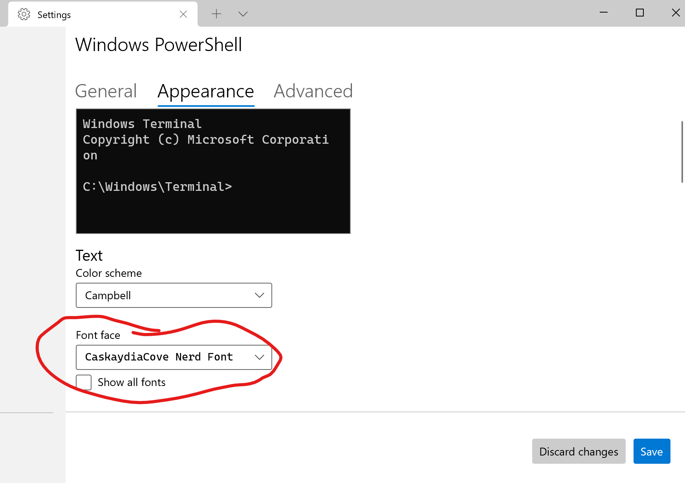
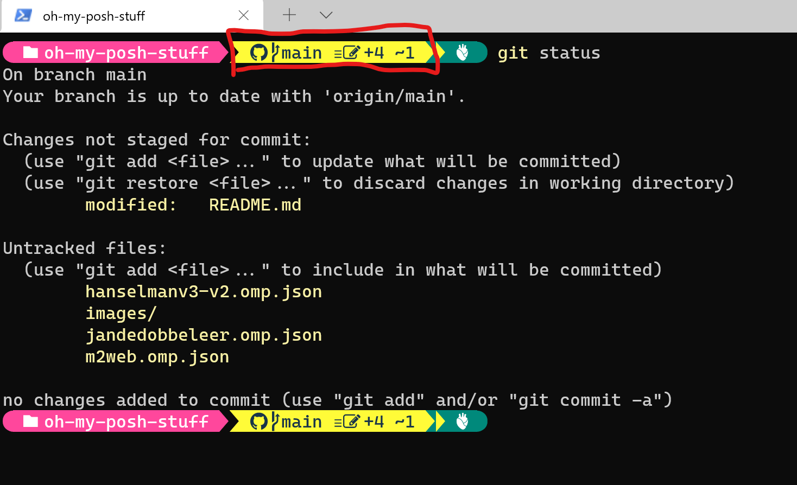

# oh-my-posh-stuff

## The Start

Per https://www.hanselman.com/blog/my-ultimate-powershell-prompt-with-oh-my-posh-and-the-windows-terminal I had the following already:
- .NET Core-powered cross-platform PowerShell
- Windows Terminal

## The Steps

First, I installed oh-my-posh:

```bash
winget install JanDeDobbeleer.OhMyPosh
```

Next, I restarted the terminal to reload the $PATH.

I then installed the Cascadia Code font from https://www.nerdfonts.com/font-downloads.

After that I created my own theme looking at https://gist.github.com/shanselman/1f69b28bfcc4f7716e49eb5bb34d7b2c?WT.mc_id=-blog-scottha as well as the themes in ~/AppData/Local/Programs/oh-my-posh/themes. I placed my theme, m2web.omp.json, in my custom ~/oh-my-posh-config folder. 

I updated the PowerShell $PROFILE using Visual Studio Code:

```bash
code $PROFILE
```

Within my editor, I added the following:

```powershell
oh-my-posh --init --shell pwsh --config ~/oh-my-posh-config/m2web.omp.json | Invoke-Expression
```

Next, I set the new Cascade Code font as the default font: 
<!--  -->
<!-- using HTML markup, as I can set the image size using the width and attribute. -->


You can also set the default font in the PowerShell settings.json file: 

```json
// stuff in the settings.json file
"profiles": 
    {
        "defaults": 
        {
            "font": 
            {
                "face": "CaskaydiaCove Nerd Font"
            }
        },
// more stuff in the settings.json file
```

## The Result

Now when I open PowerShell, I see the new prompt. Note below that the Git information is displayed with a yellow background.  
<!--  -->
<!-- using HTML markup, as I can set the image size using the width and attribute. -->


Also note that the when viewing the git status from the git bash prompt, the git status shows four untracked files, shown in the oh-my-posh prompt with a +4, and one modified file, shown in the oh-my-posh prompt with a ~1

The result is a more attractive prompt with useful information.
